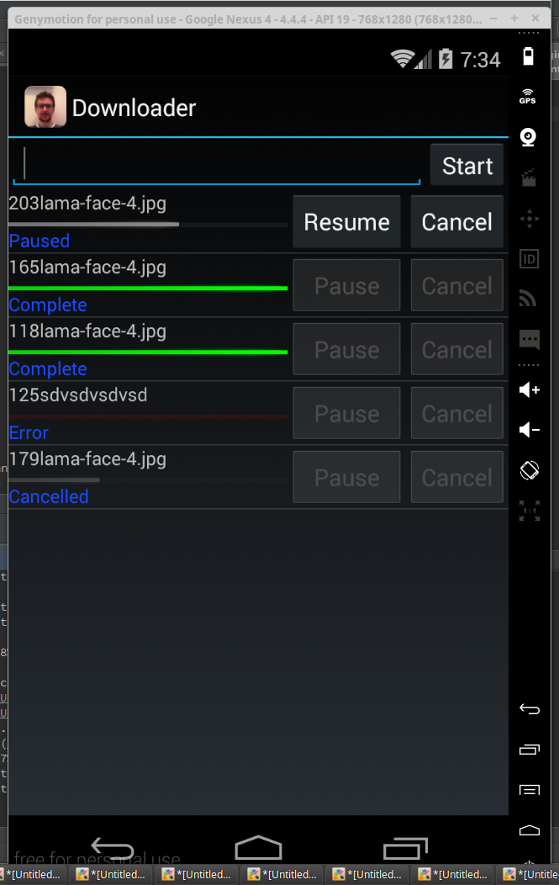
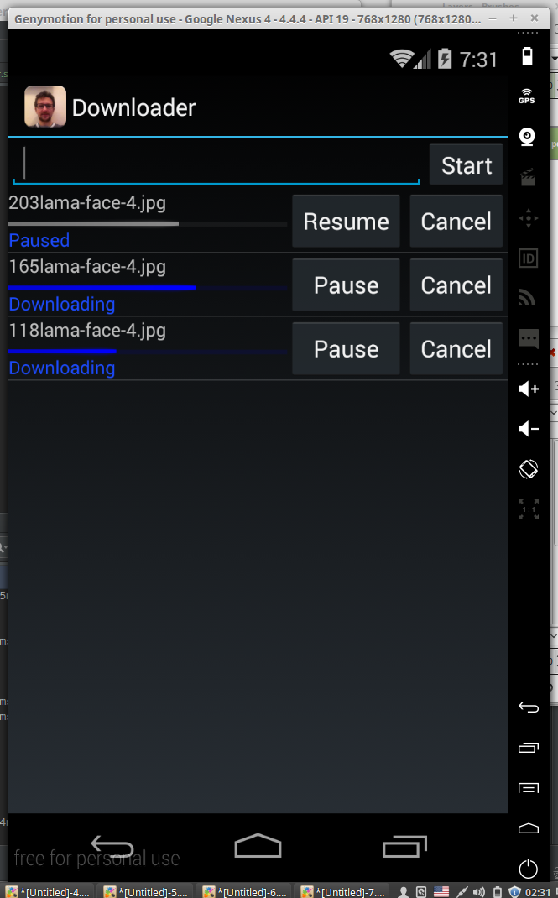
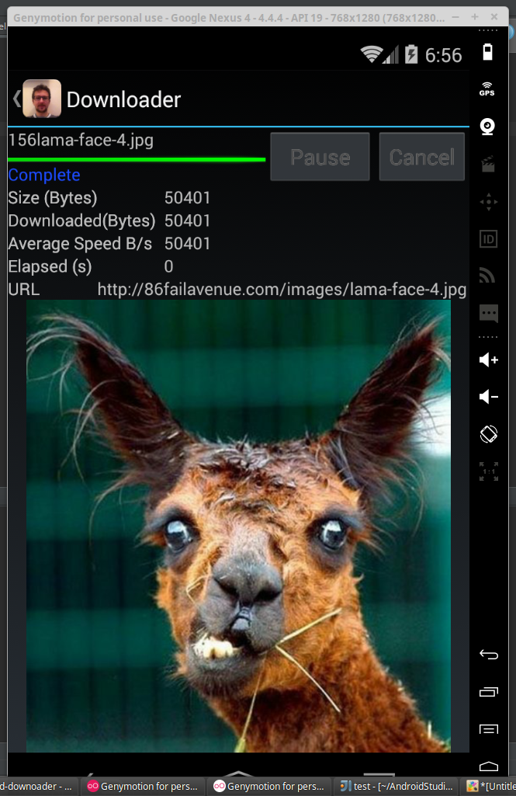

# Android download manager on Scala

This is a simple Android download manager written entirely on Scala.
It's my very first android app and first try on Scala.
So the code is a bit naive and messy.
Hope it will help somebody start new Android\Scala project.

